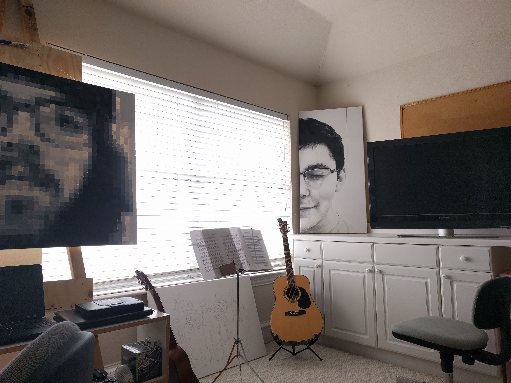

TINKER
======

..    :width: 200px
..    :height: 100px
..    :scale: 50 %
..    :alt: alternate text
..    :align: right

Section
-------

Subsection
~~~~~~~~~~

You can use ``backticks`` for showing ``highlighted`` code.

`A cool website`_

.. _A cool website: http://sphinx-doc.org

A cool bit of code::

   Some cool Code

.. code-block:: rst

   A bit of **rst** which should be *highlighted* properly.

.. code-block:: java

    @RestController
    @RequestMapping("/")
    public class MainController {

        @GetMapping("/")
        public String main() {
            return "Hello, World!";
        }
    }

.. toctree::
   :maxdepth: 2

   usage
   api
