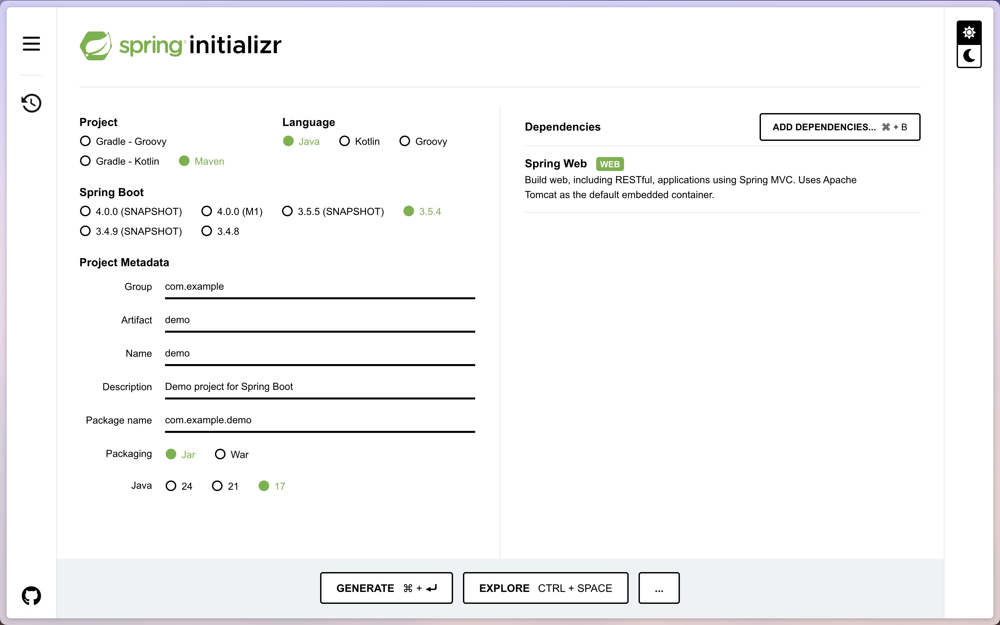

First Spring Boot Example
=========================

https://github.com/spring-boot-tutorials/spring-boot-example

In this article we will create our very first Spring Boot application

Create Initial Code Base
------------------------

- Go to https://start.spring.io/
- Click `Add Dependencies`, search for `Spring Web`, then add
- Click `Generate`

Modify Code Base
----------------

Create a new file under ``src/main/java/com/example/demo/controller/MainController.java``
with the following contents

.. code-block:: java

    @RestController
    @RequestMapping("/")
    public class MainController {

        @GetMapping("/")
        public String main() {
            return "Hello, World!";
        }
    }

Run Application
---------------

Open terminal at project root and execute the following:

.. code-block:: sh

    mvn spring-boot:run

There should be no errors and the output should look something like

.. code-block:: sh

    ...
    2025-07-28T17:45:31.524-05:00  INFO 6095 --- [demo] [           main] o.s.b.w.embedded.tomcat.TomcatWebServer  : Tomcat started on port 8080 (http) with context path '/'
    2025-07-28T17:45:31.530-05:00  INFO 6095 --- [demo] [           main] com.example.demo.DemoApplication         : Started DemoApplication in 0.814 seconds (process running for 0.953)

Verify Endpoint
---------------

In a browser, goto http:/localhost:8080/ and you should see ``Hello, World!``